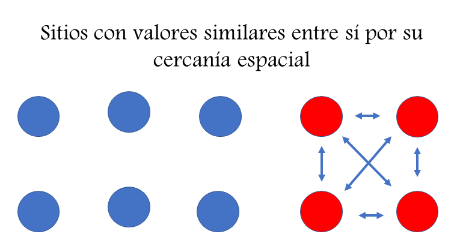
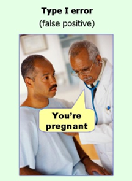

```{r setup, include=FALSE}
library(leaflet)
library(sp)
library(tidyverse)
library(kableExtra)
library(showtext)
font_add_google("Special Elite", family = "special")
showtext_auto()


options(htmltools.dir.version = FALSE)
knitr::opts_chunk$set(
  fig.width=9, fig.height=3.5, fig.retina=3,
  out.width = "100%",
  cache = FALSE,
  echo = TRUE,
  message = FALSE, 
  warning = FALSE,
  hiline = TRUE
)
```

```{r xaringan-themer, include=FALSE, warning=FALSE}
library(xaringanthemer)
style_duo_accent(
  primary_color = "#035AA6", 
  secondary_color = "black",
  header_font_google = google_font("Cabin"),
  text_font_google   = google_font("Coming Soon", "400", "400i"),
  code_font_google   = google_font("Roboto")
)
```

class: inverse, center, bottom
background-image: url("img/DSCN1531.JPG")
background-position: 50% 50%
background-size: cover

#`r rmarkdown::metadata$title`
## `r rmarkdown::metadata$subtitle`
### `r rmarkdown::metadata$author`
---

# ¿Autocorrelación espacial (ACS)?

En cualquier análisis de información espacial la ACS puede influir sobre nuestros resultados o inferencias. 

**¿Qué es la ACS?**: Correlación de una variable con ella misma, dada cierta distancia espacial. [(Fortin y Dale 2005)](https://doi.org/10.1017/CBO9780511542039).
--

```{r echo=FALSE, message=FALSE, warning=FALSE, out.width="50%", fig.align='center'}

```
---

## ¿ Qué puede causar ACS?

### Los factores más comúnes son [(Dorman *et al.* 2007)](https://onlinelibrary.wiley.com/doi/10.1111/j.2007.0906-7590.05171.x):
.pull-left[
1- **Procesos biológicos**: especiación, dispersión interacciones ecológicas entre otras, son fenómenos relacionados con el espacio.

2- **Especificación del muestreo**: Distancia de las unidades de muestreo respecto al movimiento de la especie (resolución o grano).

3- **Especificación del modelo**: Relaciones no lineales o modelos que no incluyen una variable ambiental determinante que causa la estructura espacial de la variable de interés.]

.pull-right[

```{r echo=FALSE, message=FALSE, warning=FALSE, out.width="80%", fig.align='center', fig.subcap= "Kachouie, et al. 2020. Association Factor for Identifying Linear and Nonlinear Correlations in Noisy Conditions"}
knitr::include_graphics("https://www.mdpi.com/entropy/entropy-22-00440/article_deploy/html/images/entropy-22-00440-g001.png")
```
]
---
class: inverse, center

## La ACS es ¿mala o buena?

```{r echo=FALSE, message=FALSE, warning=FALSE, out.width= "40%"}
knitr::include_graphics("https://c.tenor.com/EHVGbpNqP2oAAAAd/todo-depende-del-cristal-del-cual-se-mira-tadeo.gif")
```

---
class: inverse, center

## La ACS es ¿ mala o buena ?

.pull-left[
### Buena
Si tu pregunta ecológica se relaciona con el espacio explicitamente. Entonces la autocorrelación espacial ayudará a informar sobre cómo ocurren los procesos ecológicos en el espacio.

```{r echo=FALSE, message=FALSE, warning=FALSE, out.width="50%", fig.align='center', fig.subcap= "http://creemmural.org/secr.html"}
knitr::include_graphics("http://creemmural.org/images/leopardarea.png")
```

]
.pull-right[
### No tan buena

Es un gran problema para la prueba estadística de hipótesis y para las predicciones de las mismas, porque viola el supuesto (de casi todas las pruebas) de independencia. Lo que nos puede llevar a cometer errores  **.white[Tipo I]** o incluso invertir la relación de la pendiente en algunos análisis.

```{r echo=FALSE, message=FALSE, warning=FALSE, out.width= "30%"}

```


]
---

## Detectar y cuantificar la ACS

El primer paso antes de empezar con pruebas o modelos más complejos para lidiar con la ACS, es identificar si es en efecto un problema.
.pull-left[
### Nota
- 1- Si se realizan pruebas que asumen independencia, pero no son regresiones. La ACS debe verificarse en los datos "crudos". Ej. pruebas de t, patrones de actividad, entre otras.

- 2- En regresiones donde se modela el efecto de posibles variables ambientales, la ACS se debe verificar en los residuales.
]
.pull-right[

### Procedimientos

Existen diversos procedimientos, pero los más comúnes son la **I de Moran** o correlograma de Moran y los **semi-variogramas**.

Para este ejercicio usaremos los correlogramas de Moran, pero recomiendo que exploren las ventajas que puede ofrecer un semi-variograma.

]
---
class: inverse, center

## Estudio de caso

Tenemos un muestreo de cámaras trampa en agrupamientos, con una distancia mínima de ~ 500m. Cualquier director o fototrampero te diría que a esta distancia no hay independencia espacial. Particularmente, para especies grandes y que se mueven mucho.


```{r echo=FALSE, message=FALSE, warning=FALSE, out.width= "100%", out.height="60%"}

CToperation <- read.csv("Data/CTtable.csv") 

# Generar objeto espacial para el mapa
CT_points <- SpatialPoints(cbind(CToperation$utm_x, 
                                 CToperation$utm_y),
                           proj4string = CRS('+proj=utm +datum=WGS84 +zone=14 +towgs84=0,0,0')) 

# Proyectar a WGS solo para este paso
CT_points <- spTransform(CT_points, "+proj=longlat +datum=WGS84")

# Generar el mapa
m <- leaflet() %>%
  addProviderTiles(providers$Esri.WorldImagery, group="Satellite") %>%  # Add satellite data
  addProviderTiles(providers$Esri.WorldTopoMap, group="Base") %>% 
  addCircleMarkers(lng=coordinates(CT_points)[,1], lat=coordinates(CT_points)[,2], 
                   popup= paste(CToperation$Station)) %>% 
  # Layers control
  addLayersControl(
    baseGroups = c("Satellite", "Base"),
    options = layersControlOptions(collapsed = FALSE)
  )
m

```

---
### Datos

```{r message=FALSE, warning=FALSE}

# Tabla de funcionamiento de cámaras trampa con coordenadas
CToperation <- read.csv("Data/CTtable.csv") 

# Usaremos el archivo que creamos en survey report, se llama events_by_station2.csv

freq_reg <- read.csv("Data/surveyReport/events_by_station2.csv")%>% # Llamamos el csv
 filter(Species== "Odocoileus virginianus") %>%  # Usaremos solo los datos de venados
  left_join(CToperation, by= "Station") # Unimos para agregar las coordenadas

```

```{r echo=FALSE, message=FALSE, warning=FALSE}
knitr::kable(head(freq_reg), 'html')
```

---
## Distribución de los registros de 🦌

```{r echo=FALSE, message=FALSE, warning=FALSE, out.width="80%", out.height="200%", fig.align='center', fig.asp = 9/16}
(mapa <- freq_reg %>% # Llamamos los datos
  ggplot(aes(x=utm_x, y=utm_y))+ # Establecemos x y y
  geom_point(aes(size= n_events), alpha=0.9, colour= "steelblue")+ # Decimos que queremos geom de puntos
  scale_size(range = c(1,15))+ # La escala de los puntos
  labs(title= "Mapa de número detecciones de venado cola blanca", 
       size= "Número de \ndetecciones")+
  theme_bw()+ # Tema
  theme(text=element_text(size=15, family = "special"))) #tipo de letra
```

---
## Modelando la frecuencia de captura del 🦌

```{r message=FALSE, warning=FALSE}

sp_glmdata <- read.csv("Data/covs.csv") %>% # Llamamos las covariables que vamos a usar
  right_join(freq_reg, by= "Station")# Las unimos con nuestra tabla de número de eventos

```

```{r echo=FALSE, message=FALSE, warning=FALSE}
knitr::kable(head(sp_glmdata, 4), 'html')
```

---

## Modelando la frecuencia de captura del 🦌