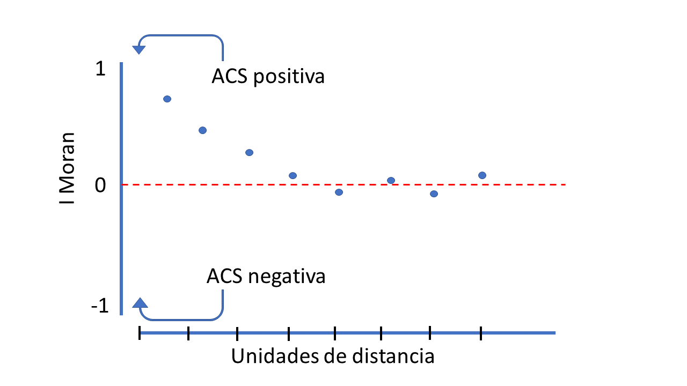

```{r setup, include=FALSE}
library(leaflet)
library(sp)
library(tidyverse)
library(kableExtra)
library(AICcmodavg)
library(DHARMa)
library(ncf)
library(MASS)
library(showtext)
font_add_google("Special Elite", family = "special")
showtext_auto()


options(htmltools.dir.version = FALSE)
knitr::opts_chunk$set(
  fig.width=9, fig.height=3.5, fig.retina=3,
  out.width = "100%",
  cache = FALSE,
  echo = TRUE,
  message = FALSE, 
  warning = FALSE,
  hiline = TRUE
)
```

```{r xaringan-themer, include=FALSE, warning=FALSE}
library(xaringanthemer)
style_duo_accent(
  primary_color = "#035AA6", 
  secondary_color = "black",
  header_font_google = google_font("Cabin"),
  text_font_google   = google_font("Coming Soon", "400", "400i"),
  code_font_google   = google_font("Roboto")
)
```

class: inverse, center, bottom
background-image: url("img/initial.jpg")
background-position: 50% 50%
background-size: cover

#`r rmarkdown::metadata$title`
## `r rmarkdown::metadata$subtitle`
### `r rmarkdown::metadata$author`; gpandradep@gmail.com
---

# 쮸utocorrelación espacial (ACS)?

En cualquier análisis de información espacial la ACS puede influir sobre nuestros resultados o inferencias. 

**쯈ué es la ACS?**: Correlación de una variable con ella misma, dada cierta distancia espacial. [(Fortin y Dale 2005)](https://doi.org/10.1017/CBO9780511542039).
--

```{r echo=FALSE, message=FALSE, warning=FALSE, out.width="50%", fig.align='center'}
knitr::include_graphics("img/fig1.png")
```
---

## ¿ Qué puede causar ACS?

### Los factores más comúnes son [(Dorman *et al.* 2007)](https://onlinelibrary.wiley.com/doi/10.1111/j.2007.0906-7590.05171.x):
.pull-left[
1- **Procesos biológicos**: especiación, dispersión interacciones ecológicas entre otras, son fenómenos relacionados con el espacio.

2- **Especificación del muestreo**: Distancia de las unidades de muestreo respecto al movimiento de la especie (resolución o grano).

3- **Especificación del modelo**: Relaciones no lineales o modelos que no incluyen una variable ambiental determinante que causa la estructura espacial de la variable de interés.]

.pull-right[

```{r echo=FALSE, message=FALSE, warning=FALSE, out.width="80%", fig.align='center', fig.subcap= "Kachouie, et al. 2020. Association Factor for Identifying Linear and Nonlinear Correlations in Noisy Conditions"}
knitr::include_graphics("https://www.mdpi.com/entropy/entropy-22-00440/article_deploy/html/images/entropy-22-00440-g001.png")
```
]
---
class: inverse, center

## La ACS es 쯠ala o buena?

```{r echo=FALSE, message=FALSE, warning=FALSE, out.width= "40%"}
knitr::include_graphics("https://c.tenor.com/EHVGbpNqP2oAAAAd/todo-depende-del-cristal-del-cual-se-mira-tadeo.gif")
```

---
class: inverse, center

## La ACS es ¿ mala o buena ?

.pull-left[
### Buena
Si tu pregunta ecológica se relaciona con el espacio explicitamente. Entonces la autocorrelación espacial ayudará a informar sobre cómo ocurren los procesos ecológicos en el espacio.

```{r echo=FALSE, message=FALSE, warning=FALSE, out.width="50%", fig.align='center', fig.subcap= "https://doi.org/10.1007/s10336-010-0583-z"}
knitr::include_graphics("img/SCR.png")
```

]
.pull-right[
### No tan buena

Es un gran problema para la prueba estadística de hipótesis y para las predicciones de las mismas, porque viola el supuesto (de casi todas las pruebas) de independencia. Lo que nos puede llevar a cometer errores  **.white[Tipo I]** o incluso invertir la relación de la pendiente en algunos análisis.

```{r echo=FALSE, message=FALSE, warning=FALSE, out.width= "30%"}
knitr::include_graphics("img/erroresTipoIyII.png")
```


]
---

## Detectar y cuantificar la ACS

El primer paso antes de empezar con pruebas o modelos más complejos para lidiar con la ACS, es identificar si es en efecto un problema.
.pull-left[
### Nota
- 1- Si se realizan pruebas que asumen independencia, pero no son regresiones. La ACS debe verificarse en los datos "crudos". Ej. pruebas de t, patrones de actividad, entre otras.

- 2- En regresiones donde se modela el efecto de posibles variables ambientales, la ACS se debe verificar en los residuales.
]
.pull-right[

### Procedimientos

Existen diversos procedimientos, pero los más comúnes son la **I de Moran** o correlograma de Moran y los **semi-variogramas**.

Para este ejercicio usaremos los correlogramas de Moran, pero recomiendo que exploren las ventajas que puede ofrecer un semi-variograma.

]
---
### Correlograma de I de Moran

 
$$I= \frac{n}{\sum_{i} \sum_{j}w_{ij}}  \frac{\sum_{i=1}^{n} \sum_{j=1}^{n} w_{i,j}(X_{i}- \overline{X})(X_{j}- \overline{X})} {(X_{i}- \overline{X})^2}$$
donde $n$ es el número de unidades $i$ y $j$; $X$ es la variable de interés; $\overline{X}$ es la media de $X$; y $w_{íj}$ es la matriz de pesos espaciales. El valor de $I$ puede tomar valores de **1** (autocorrelación positiva), **-1** (autocorrelación positiva) o **0** (distribución aleatoria).

.pull-left[
```{r echo=FALSE, message=FALSE, warning=FALSE, fig.align='center', out.height="100%", out.width="700%"}

```
]
.pull-right[ <br>
#### El correlograma es la inspección gráfica de la ACS a las diferentes distancias de pares de puntos de muestreo.]
---


class: inverse, center

## Estudio de caso

Tenemos un muestreo de cámaras trampa en agrupamientos, con una distancia mínima de ~ 500m. Cualquier director o fototrampero te diría que a esta distancia no hay independencia espacial. Particularmente, para especies grandes y que se mueven mucho.


```{r echo=FALSE, message=FALSE, warning=FALSE, out.width= "100%", out.height="60%"}

CToperation <- read.csv("Data/CTtable.csv") 

# Generar objeto espacial para el mapa
CT_points <- SpatialPoints(cbind(CToperation$utm_x, 
                                 CToperation$utm_y),
                           proj4string = CRS('+proj=utm +datum=WGS84 +zone=14 +towgs84=0,0,0')) 

# Proyectar a WGS solo para este paso
CT_points <- spTransform(CT_points, "+proj=longlat +datum=WGS84")

# Generar el mapa
m <- leaflet() %>%
  addProviderTiles(providers$Esri.WorldImagery, group="Satellite") %>%  # Add satellite data
  addProviderTiles(providers$Esri.WorldTopoMap, group="Base") %>% 
  addCircleMarkers(lng=coordinates(CT_points)[,1], lat=coordinates(CT_points)[,2], 
                   popup= paste(CToperation$Station)) %>% 
  # Layers control
  addLayersControl(
    baseGroups = c("Satellite", "Base"),
    options = layersControlOptions(collapsed = FALSE)
  )
m

```

---
### Datos

```{r message=FALSE, warning=FALSE}

# Tabla de funcionamiento de cámaras trampa con coordenadas
CToperation <- read.csv("Data/CTtable.csv") 

# Usaremos el archivo que creamos en survey report, se llama events_by_station2.csv

freq_reg <- read.csv("Data/surveyReport/events_by_station2.csv")%>% # Llamamos el csv
 filter(Species== "Odocoileus virginianus") %>%  # Usaremos solo los datos de venados
  left_join(CToperation, by= "Station") # Unimos para agregar las coordenadas

```

```{r echo=FALSE, message=FALSE, warning=FALSE}
knitr::kable(head(freq_reg), 'html')
```

---
## Distribución de los registros de 🦌

```{r echo=FALSE, message=FALSE, warning=FALSE, out.width="80%", out.height="200%", fig.align='center', fig.asp = 9/16}
(mapa <- freq_reg %>% # Llamamos los datos
  ggplot(aes(x=utm_x, y=utm_y))+ # Establecemos x y y
  geom_point(aes(size= n_events), alpha=0.9, colour= "steelblue")+ # Decimos que queremos geom de puntos
  scale_size(range = c(1,15))+ # La escala de los puntos
  labs(title= "Mapa de número detecciones de venado cola blanca", 
       size= "Número de \ndetecciones")+
  theme_bw()+ # Tema
  theme(text=element_text(size=15, family = "special"))) #tipo de letra
```

---
## Modelando la frecuencia de captura del 🦌

```{r message=FALSE, warning=FALSE}

sp_glmdata <- read.csv("Data/covs.csv") %>% # Llamamos las covariables que vamos a usar
  right_join(freq_reg, by= "Station")# Las unimos con nuestra tabla de número de eventos

```

```{r echo=FALSE, message=FALSE, warning=FALSE}
knitr::kable(head(sp_glmdata, 4), 'html')
```

---

## Modelando la frecuencia de captura del 🦌
Creamos algunos modelos que reflejan nuestras hipótesis sobre las variables que afectan la frecuencia de captura.

```{r message=FALSE, warning=FALSE}
# Modelos lineales generalizados simples

# sin variables
m0 <- glm(n_events~ 1, data = sp_glmdata, family = "poisson")

# la frecuencia de registro afectada por la distancia a cultivo
m1 <- glm(n_events~ Dcrops, data = sp_glmdata, family = "poisson")

# la frecuencia de registro afectada por el verdor de la vegetación
m2 <- glm(n_events~ MSAVI, data = sp_glmdata, family = "poisson")

# la frecuencia de registro afectada por la pendiente
m3 <- glm(n_events~ Slope, data = sp_glmdata, family = "poisson") 
          
# la frecuencia de registro afectada por la distancia a poblados
m4 <- glm(n_events~ Dpop_G, data = sp_glmdata, family = "poisson")

# la frecuencia de registro afectada por el tipo de habitat
m5 <- glm(n_events~ Habitat, data = sp_glmdata, family = "poisson" )
```
---

## Modelando la frecuencia de captura del 🦌

Según el criterio de información de AIC nuestro mejor modelo es aquel que incluye el hábitat.
```{r echo=FALSE, message=FALSE, warning=FALSE}
lista_mods <- list(m0, m1, m2, m3, m4, m5)
mod_names <- c("freq~ 1",
               "freq~ D_cultivos",
               "freq~ MSAVI",
               "freq~ Slope",
               "freq~ D_poblado",
               "freq~ Habitat"
               )

AIC <- aictab(lista_mods, modnames = mod_names, second.ord = F, sort = T)
knitr::kable(AIC, 'html', digits = 3)

```
---
## Procedemos a inspeccionar el modelo

Debido al carácter relativo del AIC es necesario verificar que el mejor modelo es un buen modelo. Un mal ajuste puede ser causado por la existencia de autocorrelación en los residuales.

```{r message=FALSE, warning=FALSE}
# Debido a que para glm poisson los residuales no se definen directamente, 
#usamos simulateResiduals del paquete DHARMa
residuales <- simulateResiduals(fittedModel = m5, plot =F)

```


```{r fig.align='center', warning=FALSE, out.height="100%", out.width="70%"}
# Verificamos visualmente que el modelo cumpla los requisitos de la distribución
plotQQunif(residuales)
```

---
class: inverse, center

# 쯉erá esta desviación del ajuste causada por la autocorrelación espacial?

```{r echo=FALSE, message=FALSE, warning=FALSE, fig.align='center', out.height="40%", out.width="40%"}
knitr::include_graphics("https://c.tenor.com/n7Q-cdm8ZLkAAAAd/suspicious-fry-futurama.gif")
```


---
## Exploremos si existe autocorrelación espacial

```{r}
# Creamos el data.frame para el análisis
data_resm5 <- data.frame(res=residuals(residuales), # Residuales que creamos
                       x= sp_glmdata$utm_x,# coordenadas en x
                       y= sp_glmdata$utm_y) # coordenadas en y
```

### Ahora usamos la función `correlog`, del paquete **nfc**

```{r message=FALSE, warning=FALSE}
m5_cor <- correlog(x=data_resm5$x, # coordenadas en x
         y=data_resm5$y, # coordenadas en y
         z=data_resm5$res, # variable de interés
         na.rm=T, # en caso de NAs
         increment = 400, # Distancia mínima de unidades
         resamp=500) # número de iteraciones
```
---
class: center

## Correlograma

Ahora tenemos nuestro primer correlograma. Pueden hacerlo con la función `plot(m5_cor)` o con el código de ggplot del scrpit.


```{r echo=FALSE, message=FALSE, warning=FALSE}
cor_m5 <- data.frame(correlation=m5_cor$correlation, distance= m5_cor$mean.of.class, p= m5_cor$p)%>% 
  mutate(p_valor= if_else(p<0.025, "significativo", "no-significativo"))

ggplot(cor_m5,aes(x=distance, y=correlation))+
  geom_hline(yintercept = 0, linetype= "dashed")+
  geom_line( size=0.9)+
  geom_point(aes(colour= p_valor),size=3)+
  scale_x_continuous(breaks = seq(0,8000, by=500))+
  ylim(-1,1)+
  labs(x= "Unidades de distancia (m)", y= " Moran I", 
       title = " Correlograma residuales ")+
  theme_classic()+
  theme(text=element_text(size=15, family = "special" ),
        axis.text.x = element_text(angle = 45, hjust=1))

```
---
class: inverse

## La autocorrelación espacial no es el problema

Ajustamos otro modelo que asumen una distribución de error *binomial negativa*. Con ello nos damos cuenta que el problema era el tipo de distribución.
```{r echo=FALSE, message=FALSE, warning=FALSE}
m5bn <- glm.nb(n_events~ Habitat, data = sp_glmdata)

residuales.bn <- simulateResiduals(fittedModel = m5bn, plot =F)

plotQQunif(residuales.bn)

```
---

class: inverse, center, midle

# Esto apenas es el comienzo
###Esto fue un ejercicio sencillo, pero lidiar con la ACS merece realizar diversas lecturas en el tema, conocer los supuestos de las técnicas y aprender a interpretar los resultados.

###En caso de encontrar ACS y dependiendo de los objetivos es recomendable usar herramientas como modelos de mínimos cuadrados generalizados (GLS), modelos mixtos, considerar a las coordenadas como covariables o modelos autorregresivos. 
NOTA: *la mayoría de estas técnicas asumen error de probabilidad con distribución normal, por lo que en muchos casos los datos deben ser transformados*

---
class: center

### Sería casi irresponsable decirte que estas listo para enfrentarte a la ACS en la vida real, así que te recomiendo leer:

- 1- [Fox *et al.* 2015. Ecological Statistics: Contemporary theory and application](https://oxford.universitypressscholarship.com/view/10.1093/acprof:oso/9780199672547.001.0001/acprof-9780199672547)]
- 2- [Plant 2019. Spatial Data Analysis in Ecology and Agriculture Using R](https://www.routledge.com/Spatial-Data-Analysis-in-Ecology-and-Agriculture-Using-R/Plant/p/book/9780367732325)
- 3- [Dorman *et al.* 2007. Methods to account for spatial autocorrelation in the analysis of species distributional data: a review](https://onlinelibrary.wiley.com/doi/10.1111/j.2007.0906-7590.05171.x)
- 4- [Kuhn & Dorman 2012. Less than eight (and a half) misconceptions of spatial analysis](https://onlinelibrary.wiley.com/doi/full/10.1111/j.1365-2699.2012.02707.x)


```{r echo=FALSE, message=FALSE, warning=FALSE, out.height="50%", out.width="50%"}
knitr::include_graphics("https://3.bp.blogspot.com/-feLSjKOc0nA/VspNAqbdzuI/AAAAAAAABAs/D1w5W-BtOSY/s1600/cat%2Bspeed%2Breader.gif")

```

---
class: inverse
background-image: url("img/end.JPG")
background-position: 50% 50%
background-size: cover

## Gracias

